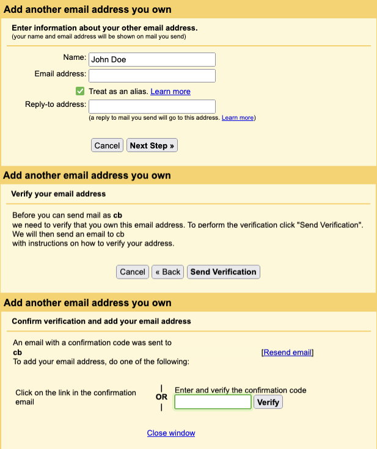
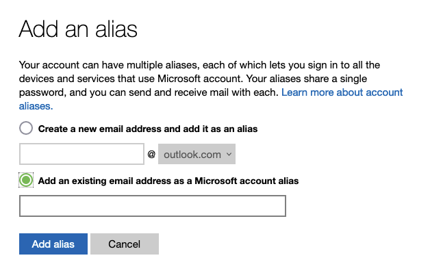

# Create an Alias

Some of the email providers has a limitation on the number of aliases you can create as well as external address names. For example iCloud email didn't allow you to setup external address name. So you can't create an alias with iCloud email.

## Create an alias with Gmail

> **Note:** You need to have [Google Workspace](https://workspace.google.com/) - Business solution to be able set the alias within the same service (no external server).

1. Log in to your Gmail account.
1. Click the gear icon in the upper-right corner and select "See all settings" from the dropdown menu.
1. Go to the "Accounts and Import" tab.
1. In the "Send mail as" section, click on "Add another email address."
1. A new window will appear. Enter the desired name and the new alias email address. Be sure to leave the "Treat as an alias" checkbox checked.
1. Click "Next Step."
1. You will be prompted to verify the new alias. Click "Send Verification."
1. Gmail will send a verification email to the alias address. Open the email and click the verification link or enter the provided confirmation code in the "Confirm verification and add your email address" window.
1. Once the alias is verified, you can now send emails using the new alias address. To do this, click "Compose" in Gmail and select the new alias from the "From" dropdown menu.

## Create an alias with Outlook

To create an alias with Outlook.com, follow these steps:

1. Log in to your Outlook.com account.
1. Click the gear icon in the upper-right corner and select "View all Outlook settings" from the dropdown menu.
1. Go to the "Mail" tab and click on "Sync email" in the left-side menu.
1. Under the "Set default From address" section, click on "Add an address."
1. A new window will appear. Enter the new alias email address and click "Add."
1. Outlook.com will send a verification email to the alias address. Open the email and click the verification link or enter the provided confirmation code in the "Verify your new alias" window.
1. Once the alias is verified, you can now send and receive emails using the new alias address. To send an email using the new alias, click "New message" in Outlook.com and click on the three-dot icon next to the "From" field. Choose the new alias from the dropdown menu.

## Create an alias with custom server

> **Note:** You need to have a custom email server or provider to be able set the alias within the required email address. Some of providers are sending a verification email to the alias address. So you need to follow the steps to send email or send them to [us](mailto:contact@onion.email?key=https%3A%2F%2Fonion.email%2Fkeys%2FOnionEmail(4ABCA2C2)%E2%80%93Public.asc) to whitelist those verification emails.

The [Roundcube webmail client](https://roundcube.net/) is a popular choice for custom email servers. To create an alias with Roundcube, follow these steps:

1. Log in to your Roundcube account.
1. Click the "Settings" icon (gear icon) in the upper-right corner.
1. In the left-side menu, click on "Filters."
1. Click on the "+" icon at the bottom-left of the filters list to create a new filter.
1. In the "Filter Definition" section, enter a name for your new filter (e.g., "Email Forwarding").
1. Under "Filter Rules," click on the "+" icon to add a new rule.
    1. In the "Field" dropdown menu, select "All" (or choose a specific field if you want to forward only specific emails).
    1. In the "Operator" dropdown menu, select "contains" (or another operator depending on your requirements).
    1. In the "Value" field, leave it blank if you selected "All" in the "Field" dropdown menu (or enter a specific value if you chose a specific field).
1. Under "Filter Actions," click on the "+" icon to add a new action.
    1. In the "Action" dropdown menu, select "Redirect message to."
    1. In the "Address" field, enter the email address you want to forward your emails to (e.g., your Onion Email address).
1. Click the "Save" button at the bottom-right corner to save your filter.

Now, all incoming emails that meet the specified filter rules will be forwarded to the email address you provided.
